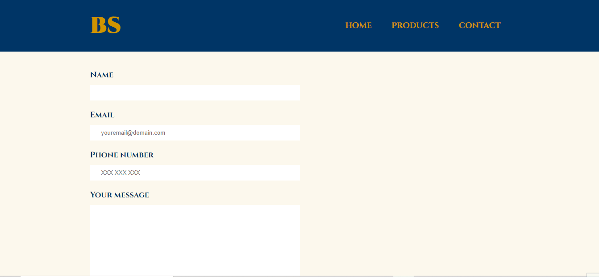
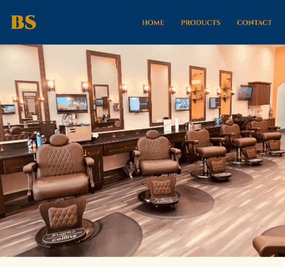
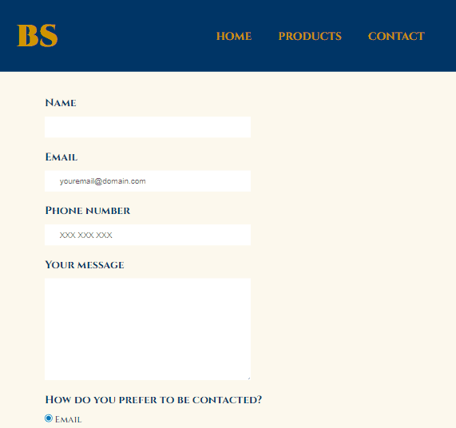
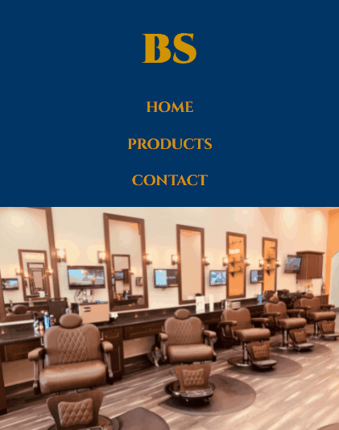
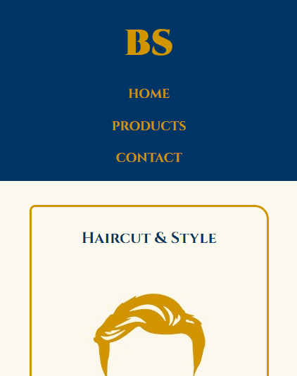
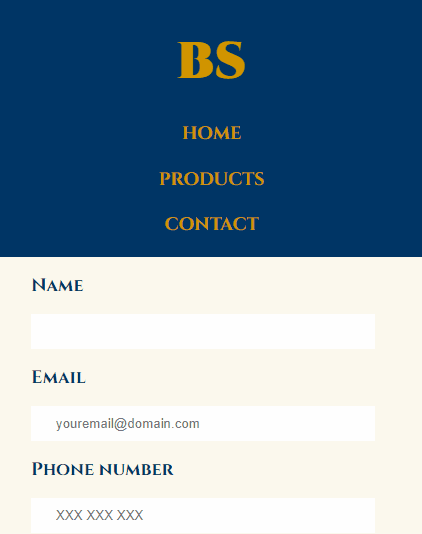

# The Barber's Shop Project

This is my first project (my first contact with web development) created during a frontend course of "HTML5 e CSS3" at Alura's plataform. 
In this classes I learned the basics of HTML5 and CSS3 and their properties, atributes, different uses and how to create a simple website.

https://bo83dev.github.io/barber-shop-project/

Desktop version

Home page: 

Products page:

Contact page:

Tablet version

Home page: 

Products page:

Contact page:

Mobile

Home page: 

Products page:

Contact page:

## Learning

I learned about:
- The cascade structure and it's importance;
- Using tags semantically;
- Responsive layout;

### Features

- [x] Home
- [x] Products page
- [x] Contact page

#### Technologies

- HTML5;
- CSS3.

