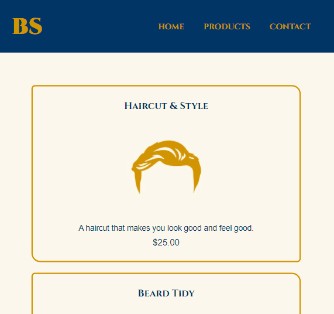

  

<h1 align='center'> The Barber's Shop </h1>

	
	
	

_Para a versão em Português, clique [aqui](#portuguese)._

### Topics

- [Project description](#project-description)

- [Technologies used](#technologies-used)

- [What I learned](#what-I-learned)

- [Features](#features)

- [Access the Project](#access-the-project)

## Project description

This is my first project (my first ever contact with web development) created during a 'Basic HTML5 and CSS3' course of the school of technology [Alura](https://www.alura.com.br).

In this classes I learned the basics of HTML5 and CSS3 and their properties, atributes, different uses and how to create a simple website.

## Technologies used

  
  

## What I learned

- The cascade structure and it's importance;
- Using tags semantically;
- About the style properties;
- Responsive layout.

### Features

- [x] Home
- [x] Products page
- [x] Contact page

## Access the Project

You can [access the project here](https://caroline-barbosa-vilar.github.io/barber-shop-project/) 

 - Mobile

Home page: 

Products page:

Contact page:

- Desktop version

Home page: 

Products page:

Contact page:

 - Tablet version

Home page: 

Products page:

Contact page:

<h1 align='center'> The Barber's Shop </h1>

	
	
		

### Tópicos 

- [Descrição do projeto](#descrição-do-projeto)

- [Tecnologias utilizadas](#tecnologias-utilizadas)

- [O que aprendi](#o-que-aprendi)

- [Funcionalidades](#funcionalidades)

- [Acesse o projeto](#acesse-o-projeto)

## Descrição do projeto 

Esse é meu primeiro projeto (meu primeiro contato com desenvolvimento web) criado durante o curso básico de 'HTML5 e CSS3' da plataforma de tecnologia [Alura](https://www.alura.com.br).

Nas aulas aprendi os componentes básicos de HTML5 e CSS3 e suas propriedades, atributos, os diferentes usos e como criar uma página web.

## Tecnologias utilizadas

  
  

## O que aprendi

- A importância da estrutura em cascata;
- O uso semântico das tags HTML;
- Sobre as propriedades de estilo(CSS);
- Sobre design responsivo.

## Funcionalidades

- [x] Home
- [x] Products page
- [x] Contact page

## Acesse o projeto

Você pode [acessar o projeto aqui](https://caroline-barbosa-vilar.github.io/barber-shop-project/) 

 - Mobile

Home page: 

Products page:

Contact page:

- Desktop version

Home page: 

Products page:

Contact page:

 - Tablet version

Home page: 

Products page:

Contact page:

Developed with 🧡 by [me](https://www.linkedin.com/in/carolinebarbosavilar/)!
